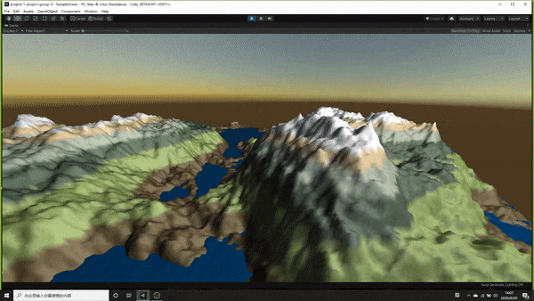

**The University of Melbourne**
# COMP30019 – Graphics and Interaction

# Procedural Terrain Generator README

## Table of contents
* [General Info](#general-info)
* [Technologies](#technologies)
* [Modelling of landscape](#modelling-of-landscape)
* [Camera Motion](#camera-motion)
* [Surface Properties](#surface-properties)

## General info
In this project, we use fractals to automatically generate a 3D landscape, and enable a user to navigate around the landscape in a ‘flight simulator’ style. We use the Diamond-Square algorithm, a de-facto standard in fractal landscape generation, to generate the terrain. The fractal also generates a heightmap which we used to construct the 3D landscape geometry.
 
## Technologies
Project is created with:
* Unity 2019.4.3f1
* Ipsum version: 2.33
* Ament library version: 999

## Modelling of landscape

The Diamond-square algorithm is a two-dimensional version of the Midpoint displacement algorithm. The algorithm is used to manipluate heightmaps to produce a natural-esk terrain. The diamond-square algorithm begins with a two-dimensional square array of width and height 2n + 1. The four corner points of the array must first be set to initial values. The diamond and square steps are then performed alternately until all array values have been set.

In our implementation, we set the outermost while loop condition as the current length of square side is greater than 1, when the current length is smaller or equal to 1, the loop will stop, which means now the square has already been decomposed to minimum, as the type of heightMap is 'int' and the minimum length of every little square is 1.

```c#
while (currentWidth > 1) {
    .
    .
    .

}
```

Let's see the example of our code!

<p align="center">
  < img src="Gifs/diamondsquare.jpeg"  width="300" >
</p >

Assume now we are doing the second loop, now we have 4 squares generated by the first loop (ABCD => Agef, Bheg, Cieh and Dfei).

Then we use the first for loop to get the center point of each four squares (j, k, l, m)

```c#
for (int x = 0; x < width; x += currentWidth)
{
  for (int y = 0; y < width; y += currentWidth)
  {
    xExtend = (x + currentWidth);
    yExtend = (y + currentWidth);
    midX = (int)(x + currentWidth / 2.0f);
    midY = (int)(y + currentWidth / 2.0f);
    float midValue = (heightMap[x, y] + heightMap[xExtend, y] + heightMap[x, yExtend] + heightMap[xExtend, yExtend]) / 4.0f;

    heightMap[midX, midY] = (float)(midValue + UnityEngine.Random.value * 2.0 * range - 0.9*range);
  }
}
```

After that, we use the second for loop to generate every center point of each vertical side (blue point of each side).

```c#
for (int x = 0; x < width; x += currentWidth)
{
  for (int y = currentWidth / 2; y < width; y += currentWidth)
  {
    if (x + currentWidth / 2 < width && x - currentWidth / 2 > 0)
    {
      heightMap[x, y] = (float)((heightMap[x, y - currentWidth / 2] + heightMap[x, y + currentWidth / 2] + heightMap[x - currentWidth / 2, y] + heightMap[x + currentWidth / 2, y]) / 4.0f + UnityEngine.Random.value * 2.0 * range - 0.9*range);
    }
  }
}
```

Finally we use the third for loop to generate every center point of each horizontal side (purple point of each side).

```c#
for (int y = 0; y < width; y += currentWidth)
{
  for (int x = currentWidth / 2; x < width; x += currentWidth)
  {
    if (y + currentWidth / 2 < width && y - currentWidth / 2 > 0)
    {
      heightMap[x, y] = (float)((heightMap[x - currentWidth/2, y] + heightMap[x + currentWidth/2, y] + heightMap[x, y - currentWidth/2] + heightMap[x, y+currentWidth/2]) / 4.0f + UnityEngine.Random.value * 2.0 * range - 0.9*range);
    }
  }
}
```

Now we finish the whole while loop, it will turn to the next, to decompose the 4 squares to 16 squares.

## Camera Motion

Camera Transformations all occur in the script 'CameraMove.cs'.

In order to pursue the surface appearance and precision, we locked and hid the cursor and the camera can move followed with the mouse movement:

<p align="left">
  
</p >

The camera can also move with the keyboard commands (w, a, s, d):

<p align="left">
  
</p >

Slide the mouse wheel forward to zoom in and slide the mouse wheel backward to zoom out.

<p align="left">
  
</p >

We also use the height to check the collision between the camera and terrain, when collision happened, the camera cannot move further.

<p align="left">
  
</p >

## Surface Properties

To give a sense of height that realistically modeled the world, the color of the terrain was generated based on height at that vertex. 

We set 6 layers for our project. The lowest layer is the water, above is land near the water, then is the grass and forest in lowlands, the forth layer is the forest in mountainside, the fifth one is the dirt in the highlands, and the top layer is the snow on the mountain peaks.

All illumination present was created by the point light source that orbited around the terrain, simulating night and day.

To ahieve realistic surface properties fo both the terrain and water, we used two seperate shaders, and both of two files are referenced from the workshop solutions.

### Terrain

For the terrain, we modified some parameters in "PhongShader.shader" to represent the properties of a mountain range as closely as possible.

#### Phong Illumination Model Parameters

  * Ks represents the specular reflections. As in the real world, the terrain only has a little relections compared to water, we just set a little bit to terrain with 0.2.

  * specN represents the specular power. As in the real world, the terrain is not completely matte and still has slight highlights, we set this parameter to 5.

### Water

For the water, we modified some parameters in "PhongShaderTexure.shader" to represent the light condition and wave sense of the water.

#### Phong Illumination Model Parameters

  * Ks represents the specular reflections. As in the real world, the water is much more shiny than the terrain, we set this parameter to 1 to show more reflections.

  * specN represents the specular power. As in the real world, the water surface has tighter highlights than the terrain, we set this to 25.

#### Vertex Shader of Wave Effect

In order to achieve the realistic wave effect, we calculated the vertex's x coordinate and the time to simulate the movement of the wave to the vertexs in the y-axis. We try to use the sine function to simulate the wave displacement. After several attempts, we got the following function to perform the wave effect.

```c#
sin(v.vertex.x + _Time.y) * 0.5f
```

## Run

1. Download or clone this repository.
2. Import `Graphics-and-Interaction-COMP30019/project-1-project-group-3` directory into Unity Hub.
3. Open `Assets/Scenes/SampleScene.unity` in Unity Editor if it has been opened automatically.
4. Click Play. You should see the generated terrain.

## Contributor

[Yuxuan Sun](https://github.com/yuxsunn)

[Zhiqing Wu](https://github.com/zhiqingw)

[Mingyue Gu](https://github.com/gmy0516)

[Jiayi Lu](https://github.com/Jiayi-Joyce-Lu)
